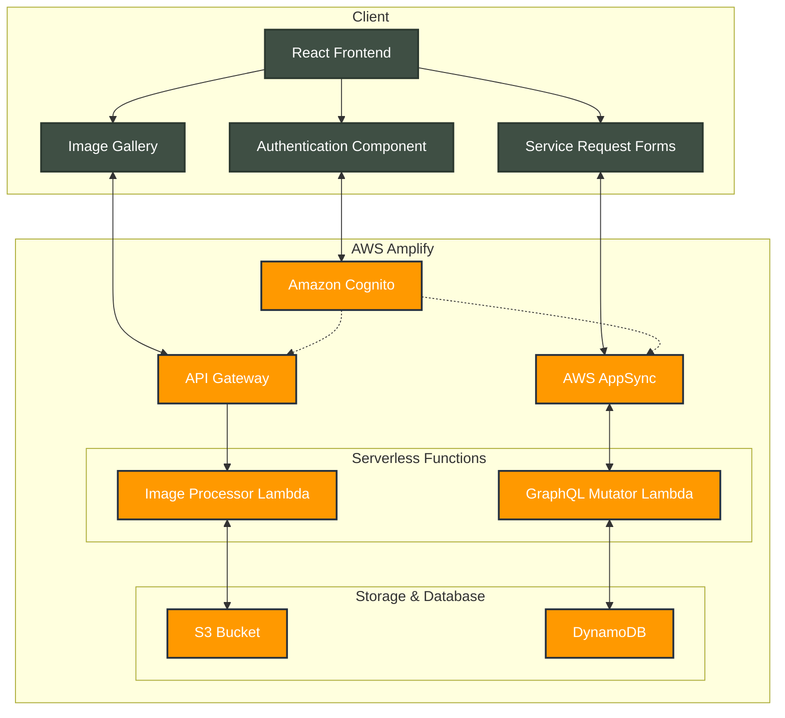

# Service Request Incident Tracker

## Overview

This project is an AWS Amplify application that provides a platform for managing service requests and incidents. It integrates user authentication, image management, and service request tracking functionalities using AWS services. The application allows users to create, and track service requests while providing visual analytics and image upload capabilities.

Live Site URL: https://main.du3glzvo2cto3.amplifyapp.com/



## Setup Instructions

1. **Clone the Repository**

   ```bash
   git clone https://github.com/saugat-15/aws-amplify-incident-tracker.git
   cd aws-amplify-incident-tracker
   ```

2. **Install Dependencies**
   Make sure you have Node.js installed, then run:

   ```bash
   npm install
   ```

3. **Configure Environment Variables**
   Create a `.env` file in the root directory and add the following variables:

   ```plaintext
   VITE_AWS_BRANCH=<your-branch-name> #i have named it sandbox-saugat
   ```

4. **Run your sandbox**
   Use the Amplify CLI to deploy the sandbox:

   ```bash
   npx ampx sandbox #remember to configure AWS credentials using amplify configure
   ```

5. **Run the Application**
   Start the development server:
   ```bash
   npm run dev
   ```

## Features

### 1. Service Request Management

- Create and track service requests with severity levels (LOW, MEDIUM, HIGH)
- Automatic resolution date calculation based on severity
- Comprehensive form validation using Zod
- Visual analytics showing severity distribution

### 2. Image Management

- Image gallery with preview capabilities and zoom functionality
- Public read access for uploaded images
- Authenticated upload restrictions
- Thumbnail generation for optimized viewing
- View all images stored in S3 bucket through an intuitive gallery interface
- Upload new images directly to S3 with drag-and-drop or file selection
- Image preview before upload
- Support for common image formats (JPEG, PNG, GIF)
- Automatic thumbnail generation for faster loading

### User Guide: Image Gallery

#### Viewing Images

- Navigate to the Image Gallery section
- Browse through all uploaded images in a grid layout
- Click on any image to view it in full size
- Use zoom controls to examine image details
- Images are loaded from S3 with optimized thumbnails for better performance

#### Uploading Images

- Click the "Upload" button in the Image Gallery
- Drag and drop images or click to select files
- Preview selected images before upload
- Click "Submit" to upload to S3
- Wait for confirmation of successful upload
- Newly uploaded images will appear immediately in the gallery

### 3. User Authentication

- Email-based authentication using AWS Cognito
- Automatic user group assignment
- Protected routes and API endpoints

## Technical Implementation

### Clean Code Principles

1. **Modular Architecture**

   - Separate components for service requests, image handling, and authentication
   - Clear separation of concerns between frontend and backend logic
   - Reusable components like form fields and image gallery
   - Shared validation schemas between client and server using Zod

2. **Container-Presentational Architecture pattern**

   - In line with container-presentational architecture, i’ve kept the business logic and rendering of data separate.
   - Container components are responsible for fetching data and managing state (business logic).
   - Presentational components focus purely on displaying data. They are passed the data as props and handle rendering the UI elements.
   - Testability: It’s easier to write tests for both the business logic (in container components) and the UI (in presentational components).


3. **Type Safety**

   - TypeScript implementation throughout the application
   - Zod schema validation for form inputs, shared across client and server
   - Strong typing for API responses and requests

4. **Error Handling**
   - Comprehensive error handling in Lambda functions
   - User-friendly error messages in the UI
   - Logging using AWS Lambda Powertools #logs can be viewed in AWS Cloudwatch for debugging and monitoring purposes and also set alarms for error metrics when required

### AWS Services Integration

1. **Authentication (Cognito)**

   - User pool configuration with email authentication
   - Automatic group assignment post-confirmation
   - Protected API endpoints using Cognito authorizers
   - Implementation of principle of least privilege:
     - Role-based access control (RBAC)
     - Granular permissions based on user groups and specific lambda functions
     - Minimal required permissions for each user role

2. **Storage (S3)**

   - Secure image storage with public read access
   - Authenticated upload capabilities with least privilege access
   - Bucket policies enforcing minimal required permissions to only allow nominated lambda function to write to the bucket
   - Efficient image retrieval and management

3. **API (AppSync & API Gateway)**
   - GraphQL API for service requests with real-time mutations
   - REST API for image handling
   - Protected endpoints with Cognito authentication and fine-grained access control
   - Optimized data operations using GraphQL mutations:
     - Atomic updates with built-in conflict resolution
     - Real-time data synchronization across clients
     - Reduced network overhead with selective field updates
     - Type-safe operations with schema validation

### Frontend Implementation

1. **React Components**

   - Responsive design using Tailwind CSS
   - Material-UI integration for enhanced UI components
   - Real-time data updates using GraphQL subscriptions

2. **State Management**
   - Form state handling with React Hooks
   - Efficient use of hooks as container-presentational architecture does the most of heavy lifting.

## Development Workflow

1. **Local Development**

   ```bash
   npm run dev
   ```

2. **Building for Production**
   ```bash
   npm run build
   ```

## Color Palette

The application uses a carefully selected color scheme that combines natural and earthy tones:

| Color Code | Preview                                                           | Usage                      |
| ---------- | ----------------------------------------------------------------- | -------------------------- |
| `#e3fcd6`  |  Light Sage  | Background, success states |
| `#2C3930`  |  Deep Forest | Primary text, headers      |
| `#A27B5C`  |  Warm Brown  | Accents, buttons           |
| `#3F4F44`  |  Muted Green | Secondary elements         |
